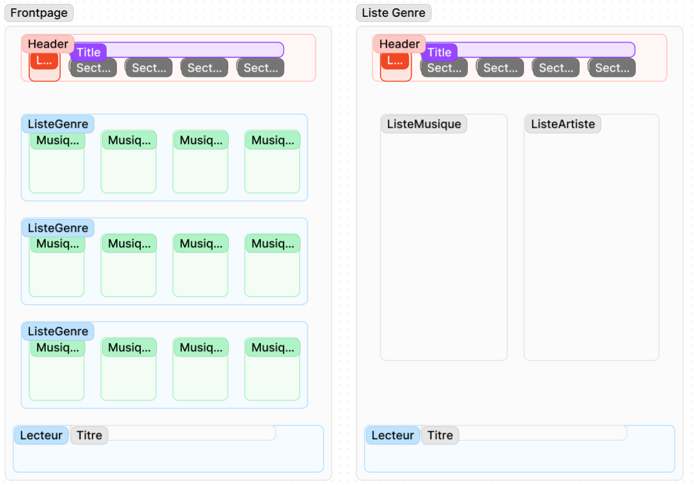

# EchoStream
## Choix du sujet
L’écoute de la musique en streaming représente une activité quotidienne pour beaucoup d'entre nous, car elle peut facilement être pratiquée en parallèle d’autres tâches comme le travail ou les trajets quotidiens.  
  
Au-delà de cet usage personnel, le streaming musical a connu une adoption massive. Il est devenu l’un des moyens les plus populaires de consommer de la musique, remplaçant largement les formats physiques et offrant une accessibilité mondiale.
## Utilité sociale
La musique en streaming joue un rôle important sur :  
- le plan médico-social car l’écoute de la musique peut améliorer le bien-être, aider à gérer le stress et l’anxiété, favoriser la motivation, la concentration, et même contribuer à la méditation. Elle a un impact positif sur la santé mentale et émotionnelle.
- Le développement territorial car Le streaming permet aux artistes issus de régions éloignées d’atteindre un public mondial. Cela leur offre des opportunités sans précédent pour se faire connaître, dépassant les limites géographiques traditionnelles.
## Effets de la numérisation
Un des avantages majeurs du streaming musical pour l'environnement est qu'il a remplacé des technologies plus anciennes comme par exemple les CD qui impliquaient une production physique et donc des émissions de plastique. De plus, il se positionne comme une alternative plus respectueuse de l’environnement aux festivals ou concerts, qui génèrent des impacts importants liés aux déplacements.  
Cependant, cette substitution aux pratiques anciennes engendre aussi un important effet rebond. La numérisation de la musique a bouleversé son mode de consommation. Avec l'accès facile à des millions de titres, la consommation de musique a fortement augmenté. Là où, il y a quelques années, un unique album CD coûtait plus de cinq euros, aujourd’hui, pour ce même montant, il est possible d’avoir accès à des millions de titres pendant un mois via une plateforme de streaming.  
  
Cette évolution pose des questions écologiques et économiques, on peut se demander :  
- si le streaming peut encourager la surconsommation de musique, car on peut désormais écouter des morceaux partout et à tout moment,
- si les fonctionnalités de ces plateformes, telles que les photos postées quotidiennement par des artistes ou les listes de lecture personnalisées qui encouragent à écouter toujours plus de musiques différentes, sont utiles.  

Il est essentiel de réfléchir à des fonctionnalités plus essentielles (en se concentrant sur l'écoute des musiques) et moins gourmandes en ressources, tout en se questionnant sur le fait que ces fonctionnalités non essentielles sont généralement activées par défaut, et l'utilisateur moyen ne prend pas toujours le temps de les désactiver même s'il ne les utilise pas.
## Scénario 1 : "Lancer une musique recommandée"
1. L'utilisateur se rend sur un site web de streaming en ligne
2. Il lance la première musique qui lui est proposée
3. Il regarde les autres musiques proposées sur la page d'accueil mais rien ne l'intéresse, il stoppe donc sa navigation.

## Scénario 2 : "Rechercher une musique spécifique"
1. L'utilisateur se rend sur un site web de streaming en ligne
2. Il recherche une musique
3. Il lance la musique trouvée

### Résultat
Pour tester les scénarios sur les sites de streaming en ligne. Nous avons dû ajouter une étape "accepter les cookies" dans notre scénario afin de le faire fonctionner.
Nous avons utilisé l'outil GreenIT en ligne de commandes pour les services Deezer et MusicMe, qui nous permet de scripter et tester nos scénarios.
Les résultats de la platforme Deezer et Musicme : [Voir le résultat](https://utt-gl03.github.io/EchoStream/benchmarks/scenario1/benchmark.html)

Les résultats de la plateforme Spotify sont différents, la stucture de la page fait que nous ne pouvons pas utiliser la version en ligne de commandes de GreenIT. Nous avons donc utilisé l'extension chrome GreenIT et changer le scénario car il fallait absolument créer un compte pour écouter de la musique. Pour utiliser cet outil nous allons nous même suivre notre scénario et faire une analyse à la fin de toutes les requêtes qui  ont été effectuées.

#### Scénario spotify :
##### Premier scénario :
1. Se rendre sur le site web et se connecter
2. Lancer la première musique proposée 
3. Regarder les autres musiques proposées sur la page d'accueil mais ne rien trouver.

##### Deuxième scénario :
1. Se rendre sur le site web et se connecter
2. Rechercher une musique précise
3. Lancer l'écoute de cette musique 

  
__Fig.1__: Résultat des scénarios Spotify

Le résultat du premier scénario (en bas) est particulièrement désastreux. Le site propose des vidéos et gifs par rapport à l'actualité des artistes ce qui est particulièrement coûteux en ressources

## Streaming d'une musique
Malheuresement l'outil GreenIT ne mesure que sur l'instant T, mais nous avons analyser manuellement l'impact du streaming d'une musique avec la console de notre navigateur.

Dans certains cas, selon le service et la durée de la musique, le fichier audio est directement chargé entièrement, et il n'y a donc pas toujours de streaming à proprement parlé. Dans d'autres cas, le service va effectuer plusieurs requêtes pour récupérer le son par morceaux.

Par exemple, MusicMe récupère les sons par morceau de 413 octets, avec une nouvelle requête à chaque fois.

## Maquette de l'interface et échantillon de données

Nous avons vu lors de nos scénarios qu'avoir des playlists personnalisées était une des fonctionnalités particulierement gourmandes. Nous avons donc opté pour un protype qui se base uniquement sur des genres de musiques, tout en gardant toute l'usabilité d'un site de streaming de musique.

Nous avons retenu deux pages type :
- celle avec les playlists par genre,
- celle d'une playlist (avec les musiques dedans et les artistes de ce genre).

  
__Fig.2__: Maquette des interfaces d'EchoStream

Pour des raisons de respect des droits d'auteurs, nous utilisons des données générées (avec dummy-json). Ces données sont générées aléatoirement et permettent d'identifier une musique, cepandant on ne peut pas générer un fichier audio donc on utilise un URL qui vient de la base de données Pixabay (voir [modele de données](frontend/sample_data.hbs)).

## Prototype n°1 : Fonctionnalités pour le scénario prioritaire avec données statiques

Pour le premier prototype : 
- notre base de données reste statique et dans le frontend,
- les fonctionnalités implémentés sont celles uniquement requises pour le scénario 1 (Rechercher une musique et l'écouter).

Ce scénario nécéssite de pouvoir rechercher parmi une liste de musiques et de l'écouter.

### Page recherche

Nous avons développé une page avec une barre de recherche et la liste des musiques.

  
__Fig.3__: Prototype de la page de recherche d'une musique

Pour l'instant nous avons choisi d'utiliser la librairie lucid-react essentiellement pour sa fonction de recherche qui permet de prototyper rapidement sans se lancer dans la conception d'un algorithme de recherche. Il s'avère que cette librairie permet aussi d'ajouter des élèments graphiques pour des contrôleurs de média, fonctions qui peuvent être assurées de manière minimaliste par le html 5. 

On a donc voulu voir quel était l'impact d'utiliser les fonctions qui ne sont pas nécessaires car déjà existantes avec l'argument 'controller' que propose la balise <audio> ou <media> de html mais qui améliore l'interface utilisateur de notre application. Nous utilisons aussi tailwind.css pour le style général de la page pour générer du css personnalisé. Nous pensons en effet que travailler l'interface utilisateur d'un service de streaming est essentiel pour s'assurer que le client apprécie son utilisation et revienne plus tard.

Nous pouvons donc ici mesurer l'impact général de la page et donc de nos choix de framework, utiliser react et les librairies pour gagner du temps sur les fonctionnalités et l'esthéthisme font que cela peut manquer d'optimisation.

Nous avons donc utilisé simplement l'extension chrome de GreenIT pour voir de manière très simple l'impact de nos choix en mesurant :
- la version de développement et de production du site web avec l'utilisation des balises html par défaut,
- les mêmes versions avec l'utilisation de lucid-react pour les élèments de contrôle de média et pour la barre de recherche.

  
__Fig.4__: Résultat des 4 tests 

Sur cette image nous avons les résultats dans l'ordre :
- de la version de production **sans** lucid-react,
- de la version de développement **sans** lucid-react,
- de la version de production **avec** lucid-react,
- de la version de développement **avec** lucid-react.

Ce qu'on lit de ces résultats c'est que les versions de développement du site web ont déjà un impact significatif. On remarque qu'utiliser des librairies pour le design uniquement a un impact asses significatif (environ 20% de différence).

Cependant une fois compilée la page est déjà beaucoup plus moderée et en plus la différence entre les deux versions ne se voit quasiment pas. On peut donc se dire que cela ne change pas grand chose avec la librairie lucid-react d'utiliser des fonctions importées pour gérer des élements de designs. 

Au final on se sait pas encore toutes les fonctionnalités qu'on utilisera ou n'utilisera pas pour finir le projet mais on peut se dire qu'on peut se sentir libre d'utiliser ou non cette librairie comme on veut car l'impact sera dérisoire.

### Execution du scénario principal

Nous pouvons donc éxecuter notre scénario principal et voir l'impact de l'utilisation de notre site comparé à nos concurrents :

[Voir le résultat](https://utt-gl03.github.io/EchoStream/benchmarks/EchoStream/scenario2/EchoStream.html)

On remarque évidemment que notre application est très loin de l'impact des services de streaming existants. Cela est tout à fait logique car nous avons bien moins de fonctionnalités et une base de données infiniment plus petite. Cependant nous avons bel et bien notre fonctionnalité principale qui consiste à écoute de la musique.

## Prototype n°2 : Fonctionnalités pour le scénario prioritaire avec données statiques chargées de manière dynamique

### Chargement dynamique des données

Dans cette seconde version du prototype, les données sont désormais chargées dynamiquement par le frontend.
En utilisant le même scénario qu'avec la première version du prototype, nous n'avons qu'une seule requête supplémentaire par page consultée.

[Voir le résultat](https://utt-gl03.github.io/EchoStream/benchmarks/EchoStream/dynamicData_scen2/EchoStream.html)

### Optimisation du nombre de requêtes

Nous nous sommes rendus compte qu'une requête était faite pour chaque musique lorsque nous chargions la mage pour charger le fichier mp3.
Nous avons donc modifié notre application pour ne charger le fichier mp3 que lorsque nous lançons la musqique. Nous perdons quelques informations non nécessaires comme la durée de la musique mais le nombre de requêtes a fortement diminué, ce qui très positif.

[Voir le résultat](https://utt-gl03.github.io/EchoStream/benchmarks/EchoStream/dynamicData_scen2_optiRequetes/EchoStream.html)

### Changement de l'outil d'analyse

Après avoir discuté de la méthode de calcul qu'utilise GreenIT, nous avons décidé d'utilisé une autre méthode afin de calculer l'impact de notre application. En effet GreenIT vise à calculer l'impact global de l'utilisation d'un site internet, que ce soit l'impact de l'achat ou la production du téléphone utilisé, l'alimentation des serveurs, la construction duréseau, etc. Cependant dans notre cas nous souhaitons plutôt connaître l'impact strictement lié à l'utilisation de notre site. 
Dans la suite du projet, nous utiliserons donc GreenFrame, un outil qui permet de calculer uniquement l'impact énergétique lié à l'utilisation de notre application web.

On veut donc re-créer un échantillon d'analyse des sites concurrents pour pouvoir comparer ce qui est comparable avec le nouvel outil, voici les résultats de l'analyse simple de la première page du site :

  
__Fig.5__: Résultat de Spotify

  
__Fig.6__: Résultat de Deezer

  
__Fig.7__: Résultat de MusicMe

On remarque ici une consommation très élevée au niveau du CPU, du réseau et de l'écran. Cependant, les impacts de la mémoire et du disque sont quasiment nuls.

On fait ensuite les modifications pour faire les tests de GreenFrame automatiquement à chaque fois que l'on modifie notre dépôt de projet GitHub. On peut voir des résultats qui nous disent que notre site consomme très peu de ressource, essentiellement du temps d'écran, la seule fonctionnalité qui a un impact significatif est celle de la recherche donc très peu de CPU utilisé. Ce sont donc des résultats très concluants par rapport aux concurrents.

Ce qui fait que nos résultats sont bien meilleurs est le fait que nous nous sommes concentrés sur la fonctionnalité essentielle de l'écoute de la musique, et non sur des fonctionnalités superflues. En réalité presque la totalité de notre impact vient de l'écran. On se rend donc ici bien compte que l'affichage des informations est la première barrière à une application écologique.

  
__Fig.8__: Résultat de notre prototype V.2

Nous avons ensuite mesuré l'impact de la partie serveur de notre prototype. On peut voir qu'il est insignifant. En effet cela est en partie dû au fait que nous avons décider de charger directement le fichier mp3 au complet. Bien qu'avoir un système de streaming permet de limiter l'impact, ce n'est pas pour les fichiers audio que cela est le plus impactant car un fichier audio n'est pas particulièrement volumineux (contrairement à un film par exemple). L'essentiel est surtout de ne pas charger le fichier tant que le musique n'est pas lue. Nous n'avons pas non plus de transformations ou calcul à faire dans le serveur qui ne fait que relayer les données qui sont stockées. Donc logiquement le seul pic de consommation est au lancement du site.

  
__Fig.9__: Résultat de notre prototype V.2 

  
__Fig.10__: Résultat de notre prototype V.2 coté serveur 

## Prototype n°3 : Fonctionnalités pour le scénario prioritaire avec données stockées dans une base de données

Pour la 3ème version de notre prototype, nous voulons que les données soient stockées dans une base de données en ligne (CouchDB). L'interêt d'une base de données dynamique est de pouvoir rajouter facilement des musiques.

  
__Fig.11__: Résultat de notre prototype V.3

On n'observe pas de différence dans l'utilisation du réseau via notre scénario GreenFrame, cela est dû au fait que dans notre scénario principal, nous récupérons toutes les musiques. Cependant pour de futurs scénarios cette base de données nous permettra de faire des requêtes spécifiques (pour ne demander qu'une seule musique par exemple, ou un seul style de musique) et ainsi de réduire le réseau utilisé. On remarque cependant une augmentation de l'usuage du CPU lié au fonctionnement de la base de données sur un docker. Cette modification de notre prototype a l'air à priori néfaste écologiquement mais deviendra à l'avenir une meilleure solution.

  
__Fig.12__: Résultat de notre prototype V.3 coté backend

## Prototype n°4 : Fonctionnalités pour le scénario prioritaire avec filtrage des données

### Passage à l'échelle

Dans le cas d'une application de streaming de musique, l'augmentation de données se traduit par une augmentation du nombre de musiques. Le poids des musiques ne va pas changer, il y en aura juste plus. Il est cependant nécessaire d'avoir une grande liberté de choix pour être compétitif donc une grande base de données. 

L'augmentation du volume de musiques semble difficile à apréhender mais il paraît assez évident que ce marché est en pleine expension et qu'il ne sera pas linéaire dans les prochaines années.

### Évolution de l'impact environnemental avant correction

La figure 9 illustre l'impact du passage à l'échelle de 10 musiques à 1000 musiques (donc multiplier par 100 de manière arbitraire).
On voit une grande augmentation de l'impact de l'écran, effectivement on a qu'une seule page donc toutes les musiques sont affichées sur l'écran d'accueil. On n'observe aucun changement sur le côté client ce qui est logique. Sur le côté serveur on voit une augmentation de 250% au niveau du CPU pour traiter les données supplémentaires et aussi une augmentation conséquente au niveau réseau.

  
__Fig.13__ : Évolution de l'impact de la consultation de la page d'accueil en passant de 10 musiques à 1000 musiques.

### Prise en compte du passage à l'échelle

Nos résultats montrent qu'on a beaucoup trop de musiques affichées sur notre site, on veut donc filtrer les musiques qu'on va afficher, en l'occurence par date de sortie pour afficher les musiques les plus récentes à l'utilisateur. 

Pour réaliser cela nous devons indexer notre base de données pour réaliser une requête dans la base de données. Du coup, dans notre cas, on va l'indexer en fonction de l'attribut release_date. Cet attribut va permettre d'avoir les musiques les plus récentes en premier, ce qui correspond à ce qui est généralement attendu dans une application de musiques. En ajoutant l'index sur cet attribut, nous pourrons ordonner efficacement les musiques par date de sortie.

### Évolution de l'impact environnemental après correction

Nous pouvons voir les effets positifs de nos changements de manière drastique. La dernière version est toujours un peu plus néfaste qu'avant mais le résultat vient surtout du fait qu'on affiche 100 musiques au lieu de 10, mais nous avons bien 1000 musiques dans la base de données. Dans les prochaines versions nous améliorerons notre application pour pouvoir accéder aux 1000 musiques sans pour autant les afficher (notamment en améliorant notre outil de recherche).

  
__Fig.14__ : Evolution de l'impact de notre application au cours des dernieres versions.

Quand on regarde les résultats plus attentivement, on voit effectivement la consommation de l'écran reduire, mais aussi qu'il consomme beaucoup moins pour accéder à la base de données grâce à notre indexation qui a amelioré l'efficacité de la base de données. Et ensuite on consomme moins de ressources en réseau car évidemment on n'affiche plus que 100 musiques au lieu de 1000.

  
__Fig.15__ : Impact de la page d'accueil avec les 100 musiques les plus récentes affichées

## Prototype n°5 : Evolution de notre fonction recherche

### Changement dans la BDD

Au cours de notre dernier prototype où nous avons augmenté la taille de notre BDD, nous avons rencontré un problème. En effet, avant le changement, nous affichions toute la BDD dans notre page d'accueuil et avions une fonction de recherche depuis les titres affichés. Quand nous avons multiplié les titres, nous ne pouvions plus afficher tous les titres de la BDD car cela avait un impact très négatif, mais du coup nous ne pouvions rechercher que dans les 100 titres les plus récents affichés et non pas dans toute notre BDD.

Pour résoudre ce problème nous avons modifié notre fonction de recherche. Dorénavant, lorsque l'utilisateur écrit quelque chose dans la barre de recherche, l'application envoie une nouvelle requête à la base de données pour trouver les titres avec le préfixe correspondant à la recherche. Cependant avant nous avions un index en fonction de la date de sortie vu que nous affichions les titres les plus récents, or on fait maintenant une requête en fonction des titres. Donc pour optimiser la recherche on a fait un nouvel index sur l'attribut "title" de notre BDD. Lorsque la barre de recherche est vide et donc qu'on affiche les titres les plus récents, on a une requête avec un tri par date et donc couchDB utilise l'index by_date. Mais si la barre de recherche contient quelque chose, on utilise juste le filtre sur le titre et donc couchDB utilise l'index by_title.
Cela permet de garder un tri sur un index simple (et non sur un double index) ce qui a un meilleur impact écologique. Nous avons estimé que lorsque l'utilisateur charge la page pour la première fois, il est plutôt interessé par les dernières sorties, alors que lorsqu'il effectue une recherche, il sait ce qu'il veut et la date a donc peu d'importance.

Après analyse des résultats, ils se sont améliorés logiquement car on a pu diminuer le nombre de musiques affichées à l'accueil de 100 à 20, tout en ayant accès aux 1000 musiques avec la fonction de recherche.

__Fig.16__ : Impact de la page d'accueil avec la nouvelle fonction de recherche.

### Changement de l'algorithme et analyse green IT

Notre algorithme actuel fait une recherche à chaque fois qu'on tape dans la barre de recherche, ce qui peut vite être contraignant car il fait beaucoup de requêtes qui peuvent être considérées inutiles. On a donc modifié la recherche pour ne faire la requête que lorsque l'utilisateur appuie sur la touche "entrée" de son clavier. Cependant l'impact de ce changement ne peut pas vraiment être vu grâce a GreenFrame, on a donc utilisé l'extension GreenIT pour voir la différence entre les deux versions.

__Fig.17__ : Impact d'une recherche de musique avant changement

__Fig.18__ : Impact d'une recherche de musique après changement

On remarque bien qu'il y a moins de requêtes et donc un meilleur impact. Nous avons tapé 4 caractères dans la barre de recherche, et plutôt que de faire une requête à chaque nouveau caractère, nous avons 1 seule requête. Il s'agit bien d'un gain de 3 requêtes.

## Prototype n°6 : Ajout de fonctionnalités sur la page d'accueil

### Proposition d'une musique aléatoire

Initialement, nous souhaitions proposer à l'utilisateur une musique sélectionnée aléatoirement parmi les musiques sorties récemment. Nous avons donc ajouté cette fonctionnalité dans le pied de page de notre page web. Parmi les 20 musiques les plus récentes retournées par la première requête à la BDD, une est sélectionnée aléatoirement et affichée en bas de la page. Ainsi, si l'utilisateur a du mal à se décider sur la musique qu'il souhaite écouter, il peut utiliser cette fonctionnalité.
Le résultat avec GreenFrame est quasiment identique au précédent.

__Fig.19__ : Impact GreenFrame de la page d'accueil avec proposition d'une musique aléatoirement

### Groupement des musiques par genre

Le deuxième ajout dans la page d'accueil est l'affichage ordonné de ces dernières. En effet actuellement elles sont uniquement triées par date. Cependant pour que l'utilisateur puisse mieux se repérer, il nous semble important de grouper les musiques du même genre ensemble. 
Nous avons essayer d'ajouter un nouvel index pour grouper les musiques lorsque nous effectuons notre requête à la base de données. Cependant lors de nos tests sur Mango l'impact était très négatif, nous avons donc priorisé le tri par date de sortie et par titre avec Mango puis effectuer le groupement par genre directement dans le frontend de l'application. Avec cette méthode l'impact est toujours visible mais suffisamment faible pour le négliger.

__Fig.20__ : Impact GreenFrame de la page d'accueil après groupement par genre des musiques

## Prototype n°7 : Ajout d'une deuxième page comme prévu dans le mock-up

Conformément aux maquettes réalisées plus tôt, nous avons ajouté une deuxième page à notre application. Celle-ci permet à l'utilisateur d'écouter des musiques dans le genre sélectionné et donc de limiter l'effet rebond discuté en début de projet.

La page consiste à afficher une liste des musiques liées au genre sur lequel l'utilisateur a cliqué dans la page principale et aussi une liste des artistes qui sont liés à ce genre.
Pour cela on a d'abord repris notre code existant pour séparer en plusieurs composants notre code car jusqu'ici nous avions juste un gros bloc. Cela nous permettra de réutiliser le design et les fonctionnalités existantes dans la nouvelle page ou de futures pages. Suite à cela nous avons eu une légère amélioration sur les résultats de GreenFrame, mais après s'être questionné dessus, nous sommes partis du principe que c'était une amélioration plutôt liée aux incertitudes de mesure qu'autre chose car il n'y avait aucune raison pour le CPU de moins consommer. On a donc ignoré ce résultat qui ne change pas grand chose.

Nous avons utilisé React Router pour gérer le fait que nous avons maintenant plusieurs pages. On a indexé notre base de données sur les genres pour la nouvelle page puisqu'on ne garde pas la fonction de recherche dans celle-ci, et on a créé un nouveau scénario GreenFrame pour tester la nouvelle page. Une fois la page réalisée les résultats GreenFrame nous montrent que le score général du site a presque doublé, ce qui est logique parce qu'il faut ajouter le résultat des deux scénarios mais en réalité la nouvelle page est du même niveau que la première, même un peu moins, la deuxième page est tout à fait acceptable en terme de consommation énergétique.

__Fig.21__ : Impact GreenFrame de la page principale après modufications

__Fig.22__ : Impact GreenFrame de la page pour une catégorie

## Prototype n°8 : Fonctionnalités mineures et refactor

### Suppresion d'un attribut dans la base de données 

Nous nous sommes rendus compte qu'un attribut dans nos données n'était jamais utilisé. Il s'agit de l'attribut "duration" supposé définir la durée d'une musique. Or la durée d'une musique est déjà définie par le fichier mp3 chargé par l'utilisateur lorsqu'il lance l'écoute de la musique. Nous avons donc décidé de supprimer cet attribut pour faire des économies d'énergie principalement du côté du CPU.
En effet après ce changement, nous avons le résultat une légère baisse de la consommation. Cela est dû au fait que nous récupérons tous les attributs des musiques dans notre requête à la base de données. Ainsi les données transmises sont plus légères.

  
__Fig.23__ : Impact GreenFrame après suppression de l'attribut "duration"

### Correction du bouton "mute"

Nous avons ensuite corrigé un bug dans notre application sur le bouton permettant de couper le son d'une musique. Ce dernier ne fonctionnait qu'une fois la musique chargée. Il ne s'agit que d'une simple correction de bug qui n'a eu aucun impact sur nos scénarios GreenFrame

### Changement de la page catégorie

Notre page de catégorie est censée afficher toutes les musiques de ce style, cepandant par soucis d'économie d'énergie on ne peut pas afficher toutes les musiques disponibles car sinon la consommation de l'écran est trop grande, et la consommation réseau est aussi trop grande.
Pour le moment notre page n'affiche que les 10 premières musiques et les artistes liée à ces 10 musiques, on a donc ajouté une fonctionnalité pour pouvoir demander de chercher plus de musiques à afficher de la base de données. Au début on faisait une grande requête avec toutes les musiques de la base de données et on en affichait que 10 par 10, cepandant cela n'est pas très optimisé comme requête. On a donc changé et utilisé le "bookmark" que donne la réponse de couchDB, celui-ci permet dans notre cas, de faire une requête de 10 musiques, et quand on appuie sur le bouton pour charger plus de musiques, il va faire une nouvelle requête en reprenant le bookmark donné par la première réponse, et couchDB va reprendre la requête là où il s'était arrêté, donc il va nous donner de la 11ème musique à la 20ème musique.

## Conclusion

La conception d'applications web durables repose sur plusieurs bonnes pratiques que nous avons mises en place dans le projet EchoStream.  
Tout d'abord nous avons **analyser** les problèmes de nos concurrents afin de ne pas répéter les mêmes erreurs et éviter les fonctionnalités ayant le plus fort impact. Nous avons **minimiser les ressources chargées** dans notre application pour ne charger une musique que lorsqu'elle est écoutée. Sur le même principe, la **pagination** est très importante afin de ne récupérer qu'une partie des données de la base et limiter l'utilisation du réseau et du CPU. Il est également important **d'optimiser ses requêtes** en utilisant notamment des index appropriés (c'est ce que nous avons fait avec `release_date` et `title`). Enfin, la **suppression des fonctionnalités non essentielles** permet de se concentrer sur ce qui est vraiment utile pour l'utilisateur et évite un impact négatif inutile.

Avec le projet EchoStream, nous retenons que des applications performantes peuvent être réalisées sans sacrifier l'**éco-responsabilité**, en privilégiant des fonctionnalités réellement utiles et la gestion judicieuse des ressources.
